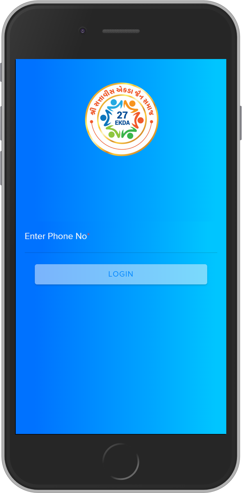
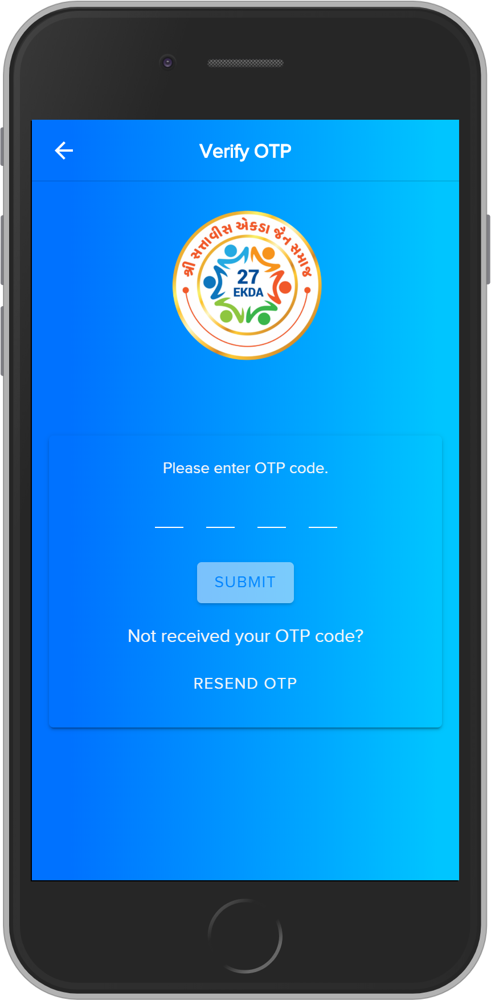
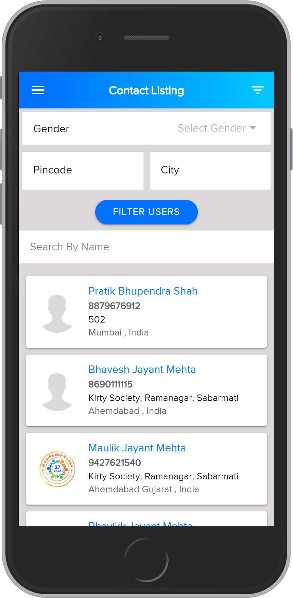
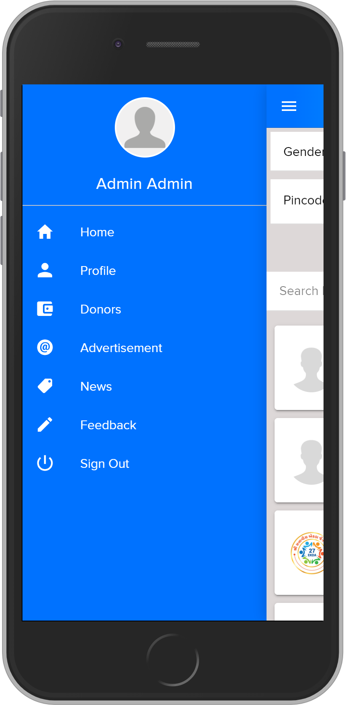
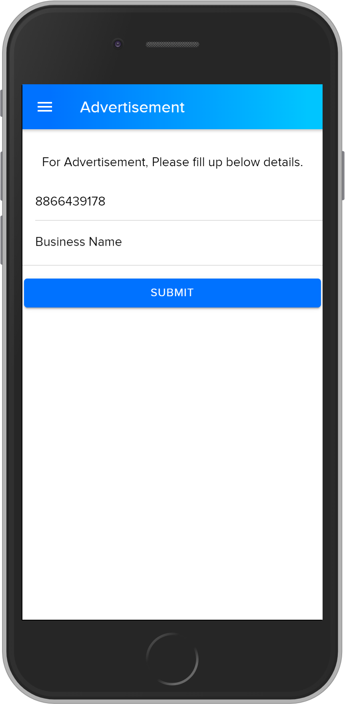
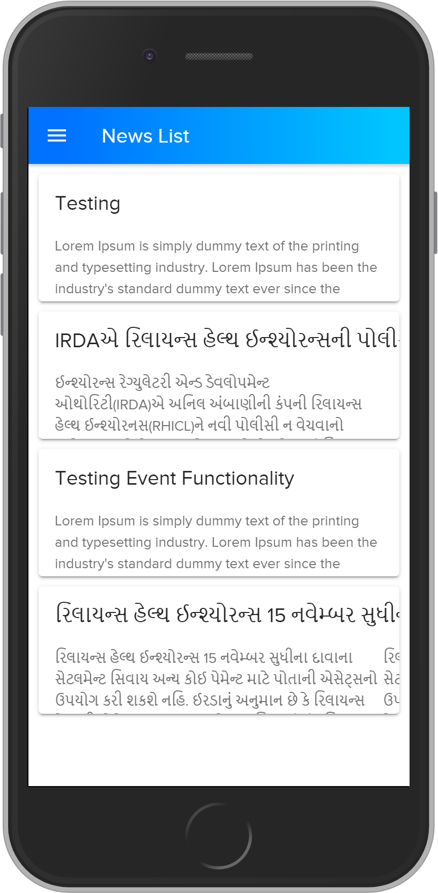

# 27 Ekda Mumbai Contact Directory

Mumbai Contact Directory

## Prerequisites
- [Ionic](https://ionicframework.com/docs/installation/cli/#install-the-ionic-cli)

## Clone Project
```
git clone https://github.com/ravi-ashara/ekda.git
```

## SCREEN SHOTS

&nbsp;
&nbsp;
&nbsp;
&nbsp;
&nbsp;
&nbsp;
&nbsp;


## Start A Local Dev Server
```
ionic serve --open
```

## Add Android Platform
```
ionic cordova platform add android
```

### Build Project
```
ionic cordova build android
```

## Run Application
```
ionic cordova run android
```

### Clean Project
```
npm run clean
```


### How to use
```
git clone https://github.com/ravi-ashara/ekda.git
cd ekda
npm i or npm install
ionic serve
ionic cordova build android
ionic cordova run android
```
